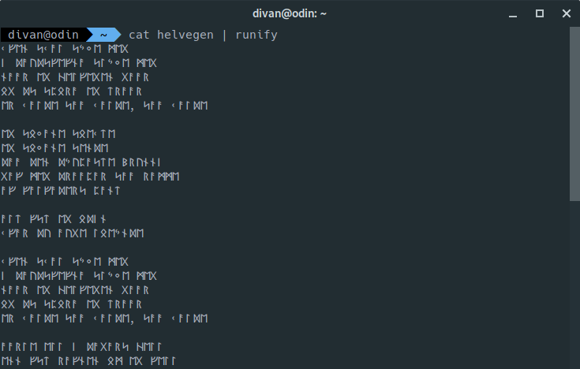
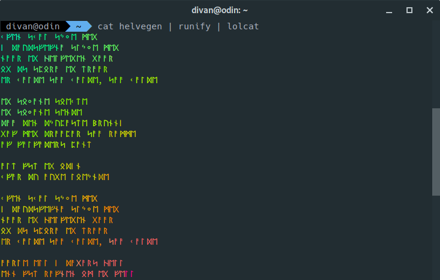

# ᚱᚢᚾᛁᚠᛃ (runify)

## Description

Converts text between Latin characters and Futhark runes. Supports both Elder Futhark (24 runes) and Younger Futhark (16 runes) systems.



You can even pipe it through lolcat for color


## Features

- **Multiple rune systems**: Elder Futhark and Younger Futhark
- **Phonetic mode**: Automatically converts digraphs like "th" → ᚦ, "ng" → ᛜ
- **Non-phonetic mode**: Letter-by-letter conversion when needed

## Usage

```sh
# Latin to Elder Futhark
echo "hello world" | runify -s elder
# Output: ᚺᛖᛚᛚᛟ ᚹᛟᚱᛚᛞ

# Younger Futhark (default)
echo "viking" | runify
# Output: ᚢᛁᚴᛁᚾᚴ

# Phonetic mode (default) - digraphs become single runes
echo "thing" | runify -s elder
# Output: ᚦᛁᛜ (th and ng as single runes)

# Non-phonetic mode - each letter becomes its own rune
echo "thing" | runify -s elder --no-phonetic
# Output: ᛏᚺᛁᚾᚷ (t-h-i-n-g as separate runes)
```

## Options

```
-h, --help              Display help and exit
-v, --version           Display version and exit
-l, --list              List available rune systems
-s, --system=SYSTEM     Specify rune system (elder, younger)
-p, --phonetic          Enable phonetic mode (default)
    --no-phonetic       Disable phonetic mode
```

## Installation

### From Binary

Download Latest Binary for your platform [here](https://github.com/divanvisagie/runify/releases)

### Install via homebrew
If you don't have the tap, add it with:
```sh
brew tap divanvisagie/homebrew-tap
```

Then simply
```sh
brew install runify
```

## Documentation

For detailed rune mappings, historical context, and sources:

- [Elder Futhark](docs/elder-futhark.md) - 24 runes, 2nd-8th century CE
- [Younger Futhark](docs/younger-futhark.md) - 16 runes, Viking Age
